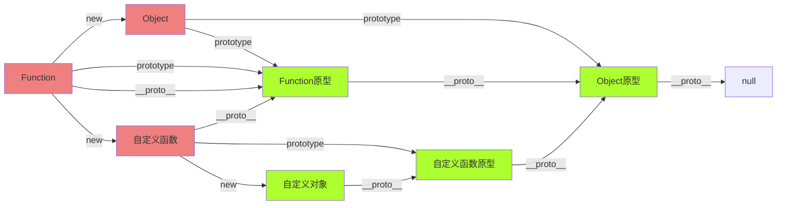

# 杂七杂八

## 深入理解原型链

- 原型和原型链
  - 所有对象都是通过`new 函数`创建
  - 所有的函数也是对象
    - 函数中可以有属性
  - 所有对象都是引用类型

- 原型 prototype
  - 所有函数都有一个属性：prototype，称之为函数原型
  - 默认情况下，prototype是一个普通的object对象
  - 默认情况下，prototype中有一个属性，constructor，它也是一个对象，它指向构造函数本身。例如：`Object.prototype.constructor===Object`

- 隐式原型 `__proto__`
  - 所有的对象都有一个属性：`__proto__`，称之为隐式原型
  - 默认情况下，隐式原型指向创建该对象的函数的原型。例如：`obj.__proto__===Object.prototype`

```js
    function A(){}
    function B(){}
    function create(){
        if(Math.random()<0.5){
            return new A()
        }else{
            return new B()
        }
    }
    var obj = create()
    // 如何得到创建obj的构造函数名称
    console.log(obj.__proto__.constructor.name)
```

- 当访问一个对象的成员时：
  1. 看该对象自身是否拥有该成员，如果有直接使用
  2. 看该对象的隐式原型是否拥有该成员，如果有直接使用
  3. 在原型链中依次查找

猴子补丁：在函数原型中加入成员，以增强起对象的功能，猴子补丁会导致原型污染，使用需谨慎。例如：`Array.prototype.abc=123`

- 原型链
  - 特殊点：
    1. Function的__proto__指向自身的prototype
    2. Object的prototype的__proto__指向null



## CMJ核心知识

- 为什么需要模块化
  - 解决全局变量污染
  - 解决依赖混乱

- 模块化的标准
  1. CommonJS CMJ 社区标准
  2. ES Module ESM 官方标准

- CMJ规范
  1. 所有的js文件均时一个模块，运行的模块是入口模块
  2. 所有的模块中的全局变量、函数，均不会产生污染（没有window对象，全局对象是global）
  3. 当一个模块需要提供一些东西给别的函数使用时，需要把这些东西「导出」
  4. 当一个模块需要用到别的模块的东西的时候，需要「导入」（模块路径必须以./或../开头）
  5. 模块有缓存，第一次运行模块后，导出结果会被缓存，之后再使用该模块，直接使用缓存结果

## webpack

- 清空输出目录 clean-webpack-plugin
- 自动生成页面 html-webpack-plugin
  - 在plugin中`new HtmlWebpackPlugin()`,也可传入对象
  - 引用模版页面。{template:'路径'}
  - 修改打包后的名称。{filename:'名称.heml'}
  - 单个或多个入口文件时，{chunks:['文件1','文件2']}默认是'all'
  - 想输出多html文件时，可复制多个`new HtmlWebpackPlugin()`进行输出，对应chunks指定js文件
- 复制静态资源 copy-webpack-pligin
  - `new CopyPligin([{from:'',to:''}])`
  - from：要复制的路径。例如./public
  - to：默认./就是dist目录
  - 当复制的文件有重复时，避免冲突就不会复制重复文件
- webpack内置插件
  - 全局常量定义
    - 在plugin中`new webpack.DefinePlugin({PI:'Math.PI',VERSION:'"1.0.0"'})`,这样就直接可以在文件中使用了。

## 高阶函数

> 两者满足其一
> 1、用函数作为参数
> 2、返回一个函数
> 目的：强化、扩展初始函数的功能。

- 并发队列

```js
/**
 * 并发执行任务
 * @param {Function[]} tasks 任务数组
 * @param {Number} parallelCount 执行数量
 */
function paralleTask(tasks, parallelCount = 2) {
    return new Promise(resolve => {
        if(tasks.length == 0) {
            // 若传空数组直接结束
            resolve();
            return;
        }
        let nextIndex = 0; // 记录执行任务的下标
        let finishCount = 0; // 记录任务完成的个数
        function _run() {
            const task = tasks[nextIndex];
            nextIndex++; // 取出当前任务后+1
            task().then(() => {
                // 当前任务完成后执行
                finishCount++; // 任务完成后+1
                if(nextIndex < tasks.length) {
                    // 判断是否还有任务执行
                    _run();
                } else if(finishCount === tasks.length) {
                    // 当所有任务完成后结束
                    resolve();
                }
            });
        }
        for(let i = 0; i < parallelCount.length && i < tasks.length; i++) {
            // i 判断执行的数量，并且 i 要小于任务数组的数量. 区分传入数组长度没数量多
            _run();
        }
    })
}
export default paralleTask;
```
